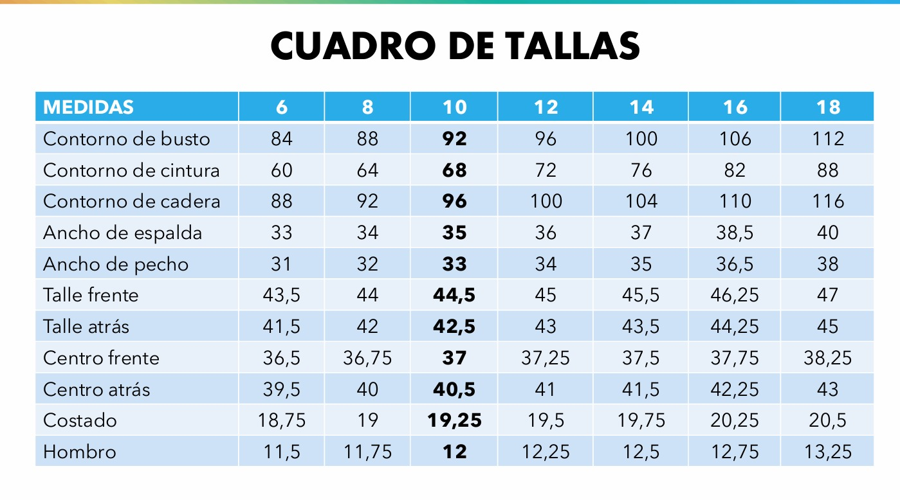

# Shirt Pattern Grader CAD 🧵👔

A high-precision, technical CAD/Illustrator-style standalone drafting and grading application for garment design. It drafts and grades front and back shirt patterns in real-time using dynamic SVG vectors and a fully editable industrial grading spreadsheet matrix.



## Features 🚀

- **AutoCAD/Illustrator-Style UI**: Flat, solid technical property panels, coordinate axis rulers, and crisp, razor-sharp vector lines (Cyan for Front, Magenta for Back).
- **Fully Editable Sizing Table**: A seamless, spreadsheet-like interactive matrix grid where modifying any size cell recalculates and updates the entire grading model in real-time.
- **Dynamic Dual Viewports**:
  - *Individual Mode*: Focus on drafting a single specific sizing.
  - *Nested Mode*: Displays the complete graded size nest (Sizes 6 to 18) simultaneously using color-coded vectors for each sizing tier.
- **Adaptive Day & Night Theme Toggler**: Toggle between a dark AutoCAD charcoal drafting theme and a clean, high-contrast white Illustrator artboard layout.
- **Interactive SVG Viewport**: Supports dragging (pan), mouse wheel scrolling (zoom), and rapid view fitting (`F` shortcut) with high-density markers and technical annotations.
- **Advanced Export Utilities**: Single-click high-resolution vectorial SVG export and physical printable template generation.

## Technical Math & Coordinate Translation 📐

The engine calculates 15 anatomical landmark points based on non-linear industrial deltas relative to the standard Base 10 sizing chart. Coordinate translation compensates for SVG screen coordinate space (origin at top-left) and maps it to typical technical drafting coordinate space (positive Y-axis goes up) with a scale multiplier of `1cm = 10px` for high detail.

## Setup & Local Execution 💻

Since the application is fully self-contained in a single, high-performance HTML/JS file with **zero third-party dependencies**, you can run it directly:

1. Clone this repository:
   ```bash
   git clone https://github.com/JulianDM1995/shirt-pattern-grader-cad.git
   cd shirt-pattern-grader-cad
   ```
2. Open `index.html` in any modern web browser, or use a local dev server:
   ```bash
   # If you have Python installed
   python3 -m http.server 8000
   ```
3. Access it at `http://localhost:8000`.

## Controls & Shortcuts ⌨️

- **Pan/Drag**: Click and drag on the canvas with the mouse pointer.
- **Zoom**: Use the mouse wheel or double-click to focus, or use the toolbar zoom buttons.
- **Fit Viewport**: Press `F` on your keyboard to instantly center and fit the entire drafting system.
- **Physical Output**: Press `Ctrl + P` / `Cmd + P` or click *Imprimir Molde Físico* to print a physical outline template.
